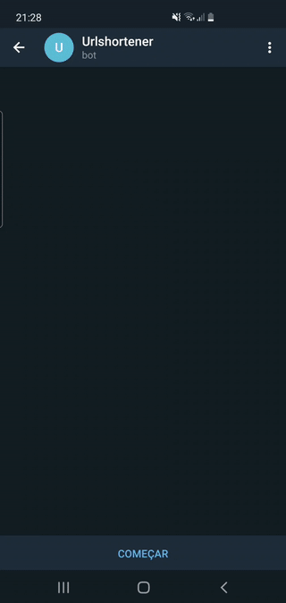

# Telegram Bot URL shortener

This is an example implementation of a **Telegram Bot** that shorten a URL.
The main purpose here is to show a simple way to use your Python codes for some task automation inside Telegram.

## Dependencies
We'll use these libraries:
* [Python Telegram Bot](https://python-telegram-bot.readthedocs.io/en/stable/) - for using telegram bots.
* [Pyshorteners](https://pyshorteners.readthedocs.io/en/latest/) - to handle url shortening.
````
pip install python-telegram-bot
pip install pyshorteners
````
## Demonstration


## The code
Here is the main function ``url_shortener()`` in [``main.py``](https://github.com/jmbenck/telegram-bot-url-short/blob/master/main.py). This starts the pyshorteners library and validate if the received message is a valid URL - using [Regex](https://docs.python.org/3/library/re.html).
If it's valid the bot sends a message as response with the shortened link. Finally, it prints the name of the user, and the URL that they shortened in the console. 
````Python3
def url_shortener(update: Update, _: CallbackContext) -> None:
    """Validate text input data as URL and shorten it."""
    s = pyshorteners.Shortener()
    link = re.findall(r'(\w*\.\w+\.*\w+.*)', update.message.text)
    if link:
        url = s.tinyurl.short(f'https://{link[0]}')
        update.message.reply_text(url)
        print(update.message.from_user.first_name, 'shortened this link:', f'https://{link[0]}')
    else:
        update.message.reply_text('Please, send me a valid URL')
````

## Run the sample code
The [``main.py``](https://github.com/jmbenck/telegram-bot-url-short/blob/master/main.py) is a demonstration code. To run your own bot.

Install dependencies
````Python3 
pip install -r requirements.txt
````
Create your Telegram Bot
* In Telegram, start a conversation with [@BotFather](https://t.me/botfather).
* Type the command ``/newbot``.
* Choose your Bot's name.
* Choose a username for your Bot.
* Then, type ``/token`` and copy it.

Change the [``main.py``](https://github.com/jmbenck/telegram-bot-url-short/blob/master/main.py) with your new Token value
````Python3
# Create the Updater and pass it your bot's token.
updater = Updater("Token")
````

That's it, now you can run the [``main.py``](https://github.com/jmbenck/telegram-bot-url-short/blob/master/main.py) and test it.
````
python main.py
````

## Contribute
That's all. Feel free for collaborating with this repo. Thank you.